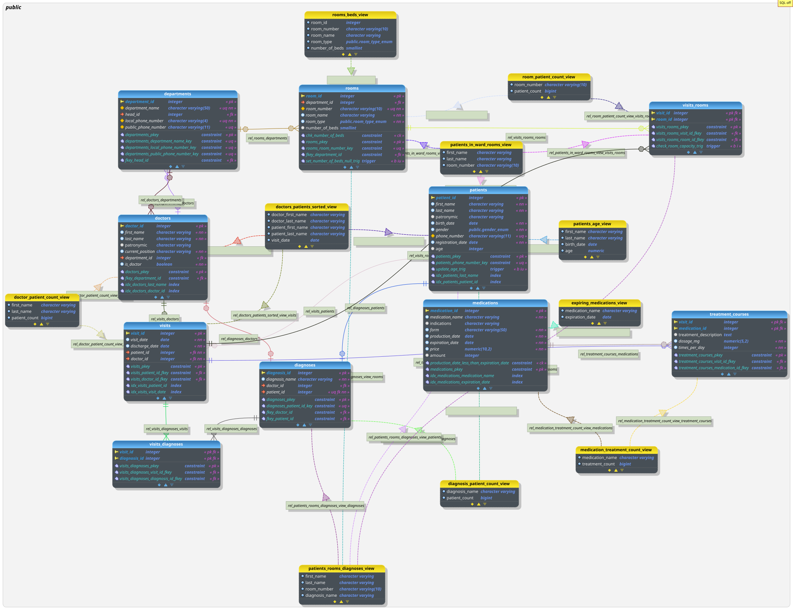

# Project work - Hospital Database

## Описание структуры базы данных

База данных "Больница" предназначена для управления информацией о пациентах, врачах, отделах, комнатах, диагнозах, визитах и лекарствах. Она может быть использована администрацией больницы, врачами и другим медицинским персоналом для ведения учета и управления медицинскими данными.

Ниже представлена структурная схема спроектированной базы данных

## Возможные запросы пользователей

* Получение информации о пациентах, их диагнозах и визитах.
* Получение информации о врачах и их специализациях.
* Управление комнатами и их типами.
* Управление лекарствами и их назначением.
* Генерация отчетов о визитах и диагнозах.

## Возможные ограничения (что можно улучшить)

* Отсутствует более общая таблица "employees" (персонал), во множество которой входили бы не только врачи, но и другие сотрудники больницы.

## Существующие таблицы

### Отделения больницы

|   departments  |
|----------------|
| department_id  |
| department_name|
| head_id        |
| local_phone_num|
| public_phone_num|

### Врачи

|     doctors    |
|----------------|
|  doctor_id     |
|  first_name    |
|  last_name     |
|  patronymic    |
|  position      |
|  department_id |
|  is_doctor     |

### Помещения

|     rooms      |
|----------------|
|   room_id      |
| department_id  |
|  room_number   |
|  room_name     |
|  room_type     |
| number_of_beds |

### Пациенты

|    patients    |
|----------------|
|  patient_id    |
|  first_name    |
|  last_name     |
|  patronymic    |
|  birth_date    |
|  gender        |
| phone_number   |
|registration_date|
|     age        |

### Диагнозы

|   diagnoses    |
|----------------|
| diagnosis_id   |
| diagnosis_name |
|  doctor_id     |
|  patient_id    |

### Посещения

|     visits     |
|----------------|
|   visit_id     |
|  visit_date    |
|  patient_id    |
|  doctor_id     |
| diagnosis_id   |

### Медецинские препараты

|  medications   |
|----------------|
| medication_id  |
|medication_name |
|  indications   |
|     form       |
|production_date |
|expiration_date |
|     price      |
|    amount      |

### Курсы лечения для пациентов (промежуточная таблица посещения-медикаменты)

|treatment_courses|
|----------------|
|   visit_id     |
| medication_id  |
|treatment_description|
|   dosage_mg    |
| times_per_day  |

### Промежуточная таблица посещения-диагнозы

| visits_diagnoses|
|----------------|
|   visit_id     |
| diagnosis_id   |

### Промежуточная таблица посещения-палаты

|  visits_rooms  |
|----------------|
|   visit_id     |
|   room_id      |
|admission_date  |
|discharge_date  |
